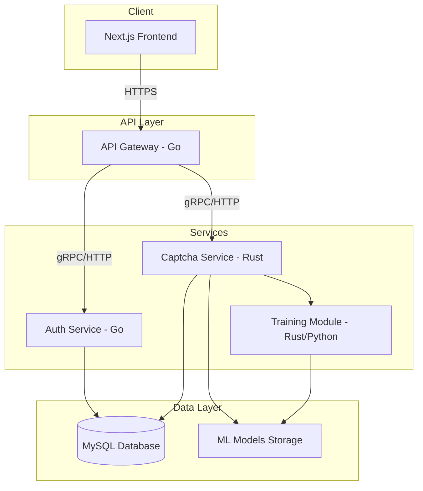
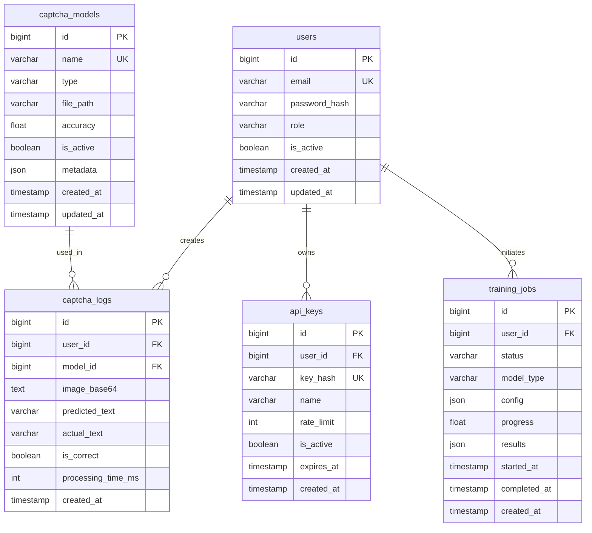
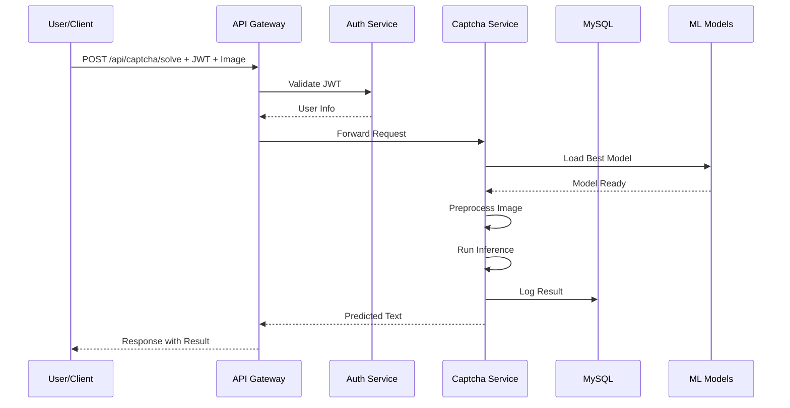

# Kế Hoạch Dự Án: Captcha Solver Platform

## 1. Tổng Quan

Dự án xây dựng một nền tảng hoàn chỉnh để giải và huấn luyện captcha, sử dụng kiến trúc microservices với:

- **Frontend**: Next.js 14+ với TypeScript, Tailwind CSS, i18n
- **Backend**: Go (Auth, API Gateway) + Rust (Captcha Service)
- **Database**: MySQL 8.0
- **Infrastructure**: Docker, Docker Compose

---

## 2. Kiến Trúc Hệ Thống



---

## 3. Cấu Trúc Thư Mục Monorepo

```
captcha-platform/
├── docker-compose.yml
├── docker-compose.prod.yml
├── .env.example
├── .gitignore
├── README.md
│
├── frontend/                    # Next.js Application
│   ├── src/
│   │   ├── app/                # App Router
│   │   ├── components/         # UI Components
│   │   │   ├── ui/            # Base UI components
│   │   │   ├── forms/         # Form components
│   │   │   └── layouts/       # Layout components
│   │   ├── lib/               # Utilities
│   │   ├── hooks/             # Custom hooks
│   │   ├── services/          # API services
│   │   ├── stores/            # State management
│   │   ├── types/             # TypeScript types
│   │   └── i18n/              # Internationalization
│   │       ├── locales/
│   │       │   ├── en.json
│   │       │   └── vi.json
│   │       └── config.ts
│   ├── public/
│   ├── Dockerfile
│   ├── package.json
│   └── docs/
│       └── FRONTEND.md
│
├── backend/
│   ├── gateway/                # API Gateway Service - Go
│   │   ├── cmd/
│   │   │   └── main.go
│   │   ├── internal/
│   │   │   ├── config/
│   │   │   ├── handlers/
│   │   │   ├── middleware/
│   │   │   └── routes/
│   │   ├── pkg/
│   │   ├── Dockerfile
│   │   ├── go.mod
│   │   └── docs/
│   │       └── GATEWAY.md
│   │
│   ├── auth/                   # Auth Service - Go
│   │   ├── cmd/
│   │   │   └── main.go
│   │   ├── internal/
│   │   │   ├── config/
│   │   │   ├── handlers/
│   │   │   ├── models/
│   │   │   ├── repository/
│   │   │   └── services/
│   │   ├── pkg/
│   │   │   ├── jwt/
│   │   │   └── crypto/
│   │   ├── Dockerfile
│   │   ├── go.mod
│   │   └── docs/
│   │       └── AUTH.md
│   │
│   └── captcha/                # Captcha Service - Rust
│       ├── src/
│       │   ├── main.rs
│       │   ├── api/
│       │   ├── models/
│       │   ├── solvers/
│       │   │   ├── ocr.rs
│       │   │   ├── cnn.rs
│       │   │   └── ensemble.rs
│       │   ├── training/
│       │   └── utils/
│       ├── models/             # Pre-trained models
│       ├── Cargo.toml
│       ├── Dockerfile
│       └── docs/
│           └── CAPTCHA.md
│
├── database/
│   ├── migrations/
│   │   ├── 001_create_users.sql
│   │   ├── 002_create_captcha_models.sql
│   │   └── 003_create_captcha_logs.sql
│   ├── seeds/
│   └── schema.sql
│
├── scripts/
│   ├── setup.sh
│   ├── deploy.sh
│   └── backup.sh
│
└── docs/
    ├── API.md
    ├── DEPLOYMENT.md
    ├── CONTRIBUTING.md
    └── SECURITY.md
```

---

## 4. Database Schema



---

## 5. Chi Tiết Các Services

### 5.1 API Gateway (Go)

**Chức năng:**
- Routing requests đến các services
- Authentication middleware (JWT validation)
- Rate limiting
- Request/Response logging
- CORS handling
- Health checks

**Tech Stack:**
- Go 1.21+
- Gin/Echo framework
- go-jwt
- Redis (rate limiting cache)

### 5.2 Auth Service (Go)

**Chức năng:**
- User registration với email verification
- Login/Logout
- JWT token generation & refresh
- Password hashing (BCrypt)
- API key management
- Role-based access control

**Endpoints:**
```
POST /auth/register
POST /auth/login
POST /auth/refresh
POST /auth/logout
GET  /auth/me
POST /auth/api-keys
DELETE /auth/api-keys/:id
```

### 5.3 Captcha Service (Rust)

**Chức năng:**
- Giải captcha từ hình ảnh
- Hỗ trợ nhiều loại captcha text-based
- Model management (load/unload)
- Training pipeline
- Batch processing

**Solvers:**
1. **OCR Solver**: Tesseract-based cho captcha đơn giản
2. **CNN Solver**: Deep learning model cho captcha phức tạp
3. **Ensemble Solver**: Kết hợp nhiều models

**Endpoints:**
```
POST /captcha/solve
POST /captcha/solve/batch
GET  /captcha/models
POST /captcha/models/upload
POST /captcha/train
GET  /captcha/train/:job_id
```

---

## 6. Frontend Features

### Pages:
- `/` - Landing page
- `/login` - Đăng nhập
- `/register` - Đăng ký
- `/dashboard` - Dashboard chính
- `/solve` - Interface giải captcha
- `/models` - Quản lý models
- `/training` - Huấn luyện model mới
- `/api-keys` - Quản lý API keys
- `/docs` - API Documentation

### i18n Support:
- Vietnamese (vi) - mặc định
- English (en)

---

## 7. Docker Configuration

### Development:
```yaml
services:
  frontend:
    build: ./frontend
    ports: ["3000:3000"]
    volumes: ["./frontend:/app"]
    
  gateway:
    build: ./backend/gateway
    ports: ["8080:8080"]
    
  auth:
    build: ./backend/auth
    ports: ["8081:8081"]
    
  captcha:
    build: ./backend/captcha
    ports: ["8082:8082"]
    
  mysql:
    image: mysql:8.0
    ports: ["3306:3306"]
    
  redis:
    image: redis:alpine
    ports: ["6379:6379"]
```

### Production:
- Multi-stage builds
- Non-root users
- Health checks
- Resource limits
- Secrets management

---

## 8. Bảo Mật

### Environment Variables:
```env
# Database
DB_HOST=
DB_PORT=
DB_NAME=
DB_USER=
DB_PASSWORD=

# JWT
JWT_SECRET=
JWT_EXPIRES_IN=

# Redis
REDIS_URL=

# API
API_RATE_LIMIT=
CORS_ORIGINS=
```

### Security Measures:
- Password hashing với BCrypt (cost 12)
- JWT với RS256 hoặc HS256
- HTTPS enforced trong production
- SQL injection prevention (prepared statements)
- XSS protection (sanitization)
- CSRF tokens
- Rate limiting
- Input validation
- Audit logging

---

## 9. Testing Strategy

### Backend:
- Unit tests cho business logic
- Integration tests cho API endpoints
- Load testing với k6/wrk

### Frontend:
- Jest + React Testing Library
- Playwright cho E2E tests
- Storybook cho component testing

---

## 10. Luồng Xử Lý Chính

### Giải Captcha Flow:



---

## 11. Roadmap Triển Khai

### Phase 1: Foundation
- [ ] Setup Monorepo structure
- [ ] Docker Compose configuration
- [ ] Database schema & migrations
- [ ] Basic Auth Service

### Phase 2: Core Services
- [ ] API Gateway với middleware
- [ ] Captcha Service với OCR
- [ ] Frontend skeleton với i18n

### Phase 3: Advanced Features
- [ ] CNN model integration
- [ ] Training pipeline
- [ ] Dashboard & analytics

### Phase 4: Production Ready
- [ ] Security hardening
- [ ] Performance optimization
- [ ] Documentation
- [ ] Testing & CI/CD

---

## 12. Notes

- Code phải clean, có comments rõ ràng
- Mọi config đều qua environment variables
- Logging đầy đủ cho debugging
- API versioning (v1, v2...)
- Backward compatibility